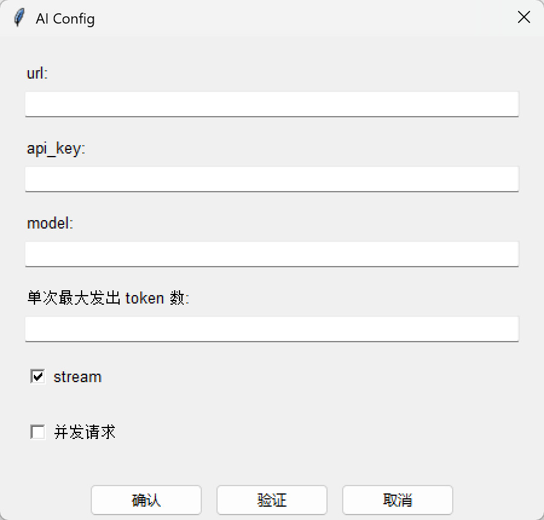
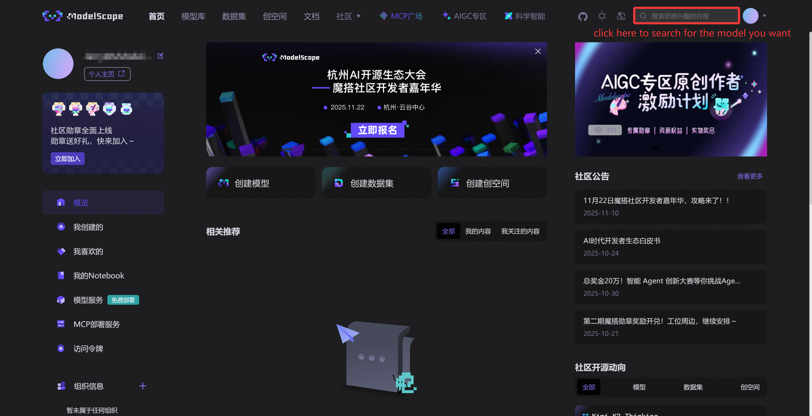
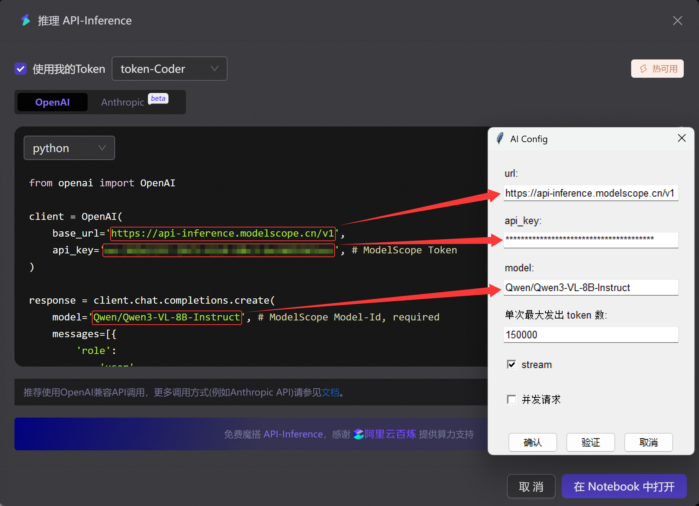
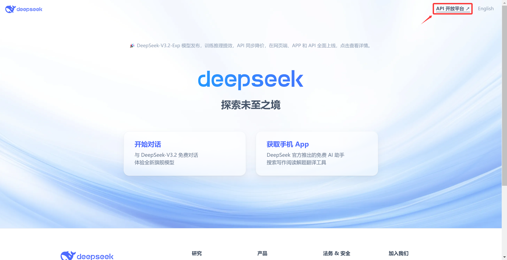
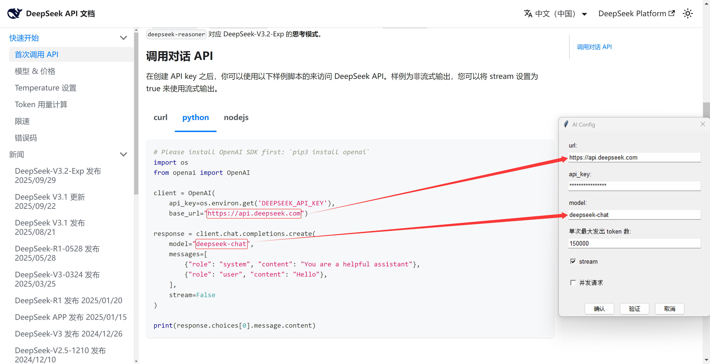
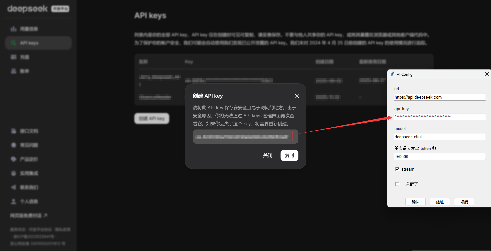

# AIConfigure

这篇文档介绍如何配置 AI 参数。

## Entrance

顶部菜单：`工具 → AI配置`



## Configure

AI插件将会以下面这样的代码调用您的配置：

```python
from openai import OpenAI

client = OpenAI(
    base_url = ai_config["url"],
    api_key  = ai_config["api_key"],
)

response = client.chat.completions.create(
    model    = ai_config["model"],
    messages = [{"role": "user", "content": prompt}],
    stream   = ai_config["stream"]
)
```

其中：

- `ai_config["url"]` 是您设置的 url
- `ai_config["api_key"]` 是您设置的 api_key
- `ai_config["model"]` 是您设置的 model
- `ai_config["stream"]` 是您设置的 stream
- `prompt` 是发送的提示词，其 token 数不会超过您设置的“单次最大发出 token 数”。

如果您勾选了“并发请求”，那么在进行大批量的请求发送时，会进行异步并发加速。**注意**，对于某些有并发限制的供应商，这可能会导致报错。

完成配置后，您可以点击“验证”来验证您的输入是否有效，这会尝试发送一个简单的请求。

## Example

所有提供了 Python 的 `openai` 库接口的运营商的模型都可以配置，下面提供一些例子来演示。

### ModelScope

[魔搭社区](https://www.modelscope.cn/)提供了对部分开源模型的 API 调用，每天有 2000 次免费额度。



以 Qwen3 为例：




ModelScope Token 是需要您自己去申请的，获取方式见[API推理介绍](https://www.modelscope.cn/docs/model-service/API-Inference/intro)。

### DeepSeek

[DeepSeek](https://www.deepseek.com/) 也提供了 [API 接口](https://api-docs.deepseek.com/zh-cn/)。






