# 关于页面矩形与画布矩形的讨论

## 坐标系

`tkinter` 和 `pymupdf` 库的坐标系。

### 坐标轴

这两个坐标系方向是一样的：

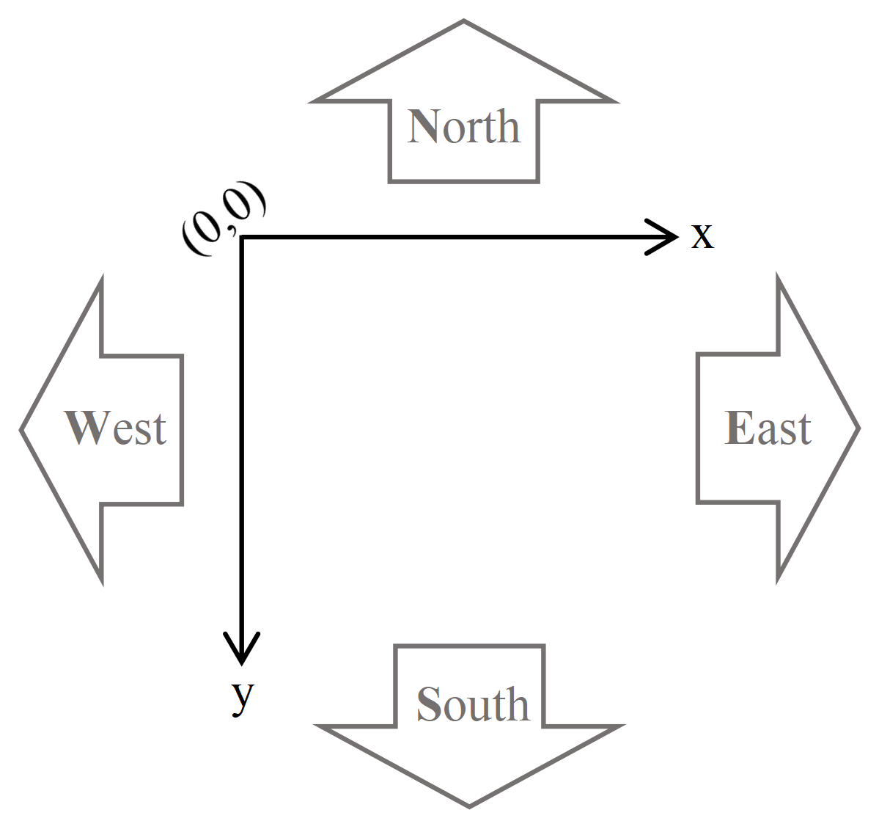

### 原点

原点都在左上角（西北方）。

### 单位长度

这两个坐标系的单位长度是一样的，都是**逻辑像素**，而不是真的显示器上的像素。

## 对象

假设我们导入了：

```python
from tkinter import Canvas
from pymupdf import Page, Rect
```

在我们项目的 `Tab` 类里有两个属性：

- `Tab.canvas` ：这是一个 `Canvas` 对象，用于在窗口上绘制 PDF 页面。
- `Tab.doc` ：这是一个 `pymupdf.Document` 对象，通过它，我们可以得到这个文档里的所有页面（ `Page` 对象）。

我们接下来讨论的对象是：

- `canvas` ：
    - 可以通过 `canvas.winfo_width()` 方法获得它的宽度。
    - 可以通过 `canvas.winfo_height()` 方法获得它的高度。
- `page.rect` ：这是一个 `Rect` 对象，是页面的边框矩形。
    - 可以通过 `page.rect.x0` 、 `page.rect.y0` 获得它的左上角坐标，一般是 $(0, 0)$ 。
    - 可以通过 `page.rect.x1` 、 `page.rect.y1` 获得它的右下角坐标。
    - 可以通过 `page.rect.width` 、 `page.rect.height` 获得它的宽度（`x1 - x0`）和高度（`y1 - y0`）。

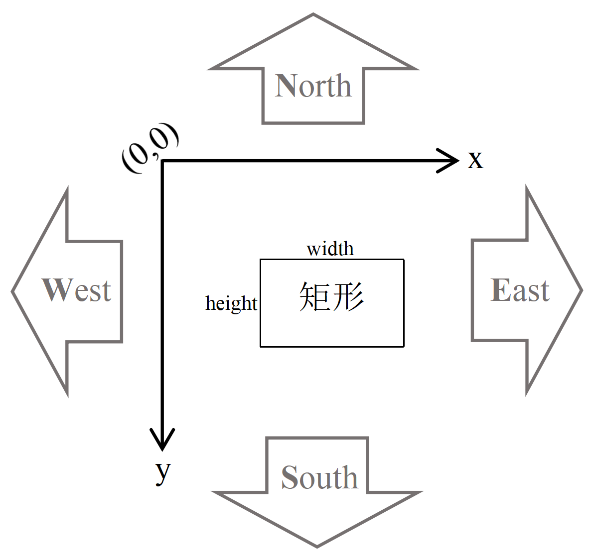

## 切入正题

注：以下讨论均不用考虑页面旋转的情况，因为页面旋转是原地操作，页面的宽度和高度会自动交换。

### 页面布局（视图）

主要讨论一下大小不同的页面的布局方式。

（有  标志的表示 SumatraPDF 的做法，有  标志的表示 Microsoft Edge 的做法）

#### 单页连续（`"continue"`）

当页面的宽度不一致时：Which one do you prefer?

- [ ] 左侧对齐

    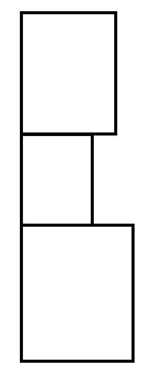

- [ ] 右侧对齐

    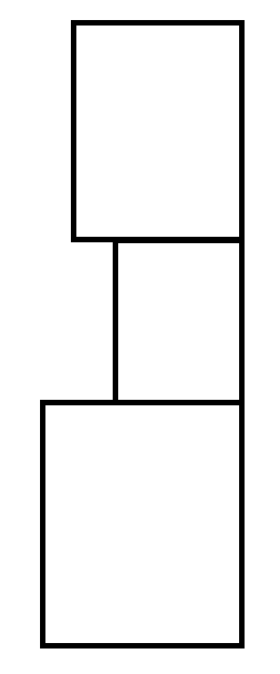

- [x] 居中对齐

    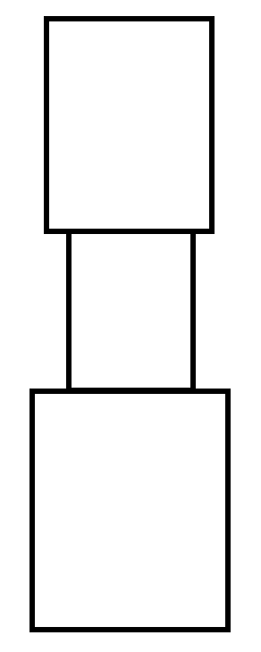

- [ ] 放缩到一样的页宽度

    

    - [ ] 与最宽页面同宽
    - [ ] 与最窄页面同宽
    - [ ] 与平均宽度同宽
    - [ ] 与众数同宽

#### 双页/书籍不连续（`"facing"` or `"book"`）

当页面高度不一致时：

- [ ] 上侧对齐

    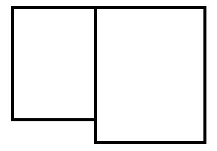

- [ ] 下侧对齐

    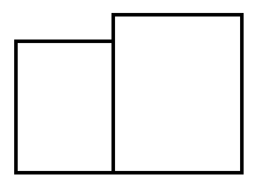

- [x] 居中对齐

    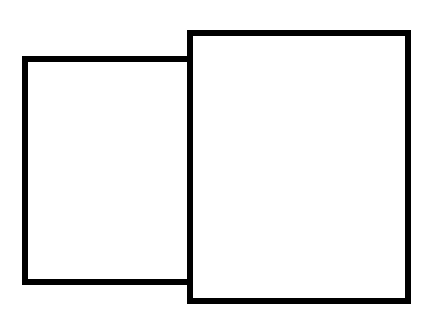

- [ ] 放缩到一样的页高度

    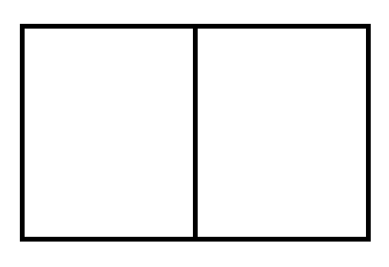

    - [ ] 与最高页面同高
    - [ ] 与最矮页面同高
    - [ ] 与平均高度同高
    - [ ] 与众数同高

#### 双页/书籍连续（`"continue facing"` or `"continue book"`）

一行有两页，一行内的处理同“双页/书籍不连续”。

当页面宽度不一致时，靠中缝线对齐：


### 坐标转换

#### 布局

通过以上对页面布局的讨论，对于一份 PDF 文档，我们能得到它的布局（以双页连续为例）：

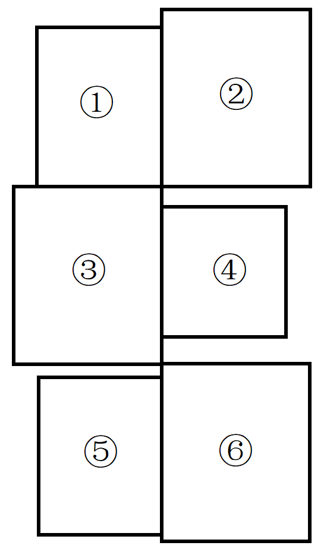

显然，现在所有页面的左上角坐标 `(page.rect.x0, page.rect.y0)` 都不是 `(0, 0)` 。

假设 `ViewPlugin` 可以计算出：在当前视图模式下，所有页面的矩形：

```python
[rect_0, rect_1, rect_2, ...]
```

- `recti` 是 `pagei` 的矩形。

经过 `zoom` 倍缩放后，所有矩形的坐标都乘 `zoom` 。

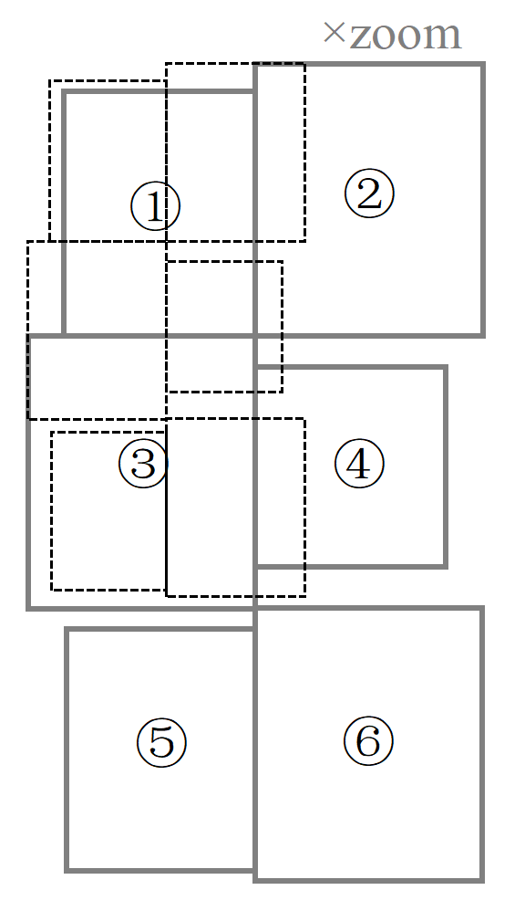

下面讨论其中的一个矩形 `rect` ，要把这个页面矩形定位到画布（`canvas`）上

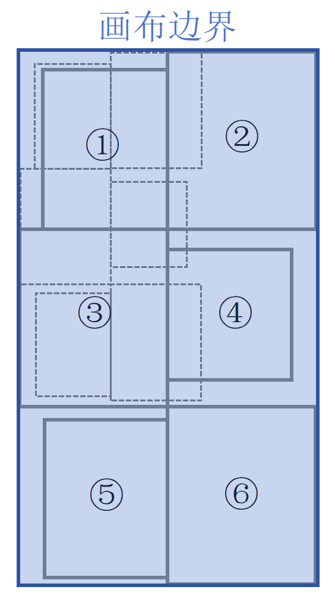

- 画布的边界就是刚好能装下这些矩形，“画布边界”的宽度和高度是 `Tab.canvas_width` 、 `Tab.canvas_height` （由 `ViewPlugin` 计算，并用 `property` 动态挂到 `Tab` 类上），即，画布的真实大小。

若放缩程度为 `1` （无放缩），则该页面在画布上的坐标、大小就是 `rect` 。

若放缩程度为 `zoom` （$\text{zoom} \in \R^{+}$），则该页面在画布上的矩形为 `rect * zoom` 。

- 对 `Rect` 对象的数乘表示将它的 `x0` 、 `y0` 、 `x1` 、 `y1` 都乘 `zoom` 。

由于窗口大小有限，用户只能看到一整份文档的一部分：

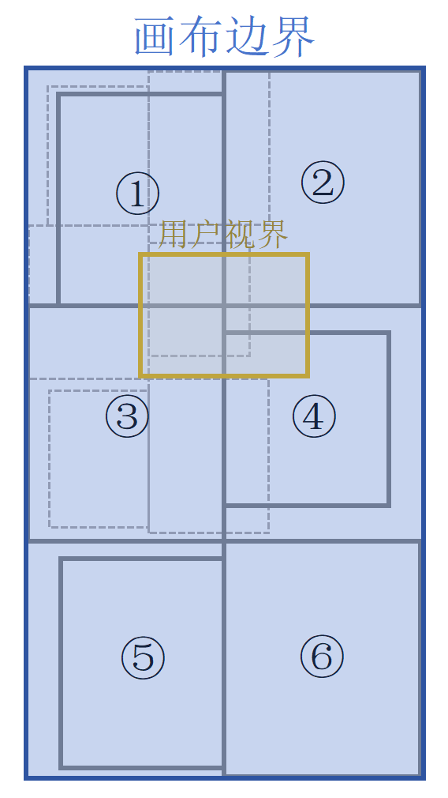

这个“用户视界”的宽度和高度就是 `Tab.canvas.width` 、 `Tab.canvas.height` ，即，画布的可见区域的大小。注意与上面的 `Tab.canvas_width` 、 `Tab.canvas_height` 进行区分。

> [!TIP]
>
> - [ ] 如果实在是难以区分的话，是否要把属性名改一下？

#### 渲染

在未缩放的页面矩形平面上定位“用户视界”：设这个用户视界在未缩放的页面矩形平面上的位置矩形为 `rect_view` ，则有：

- `rect_view.x0 = rect_j.x0 + scroll_pos[0]` 

- `rect_view.y0 = rect_j.y0 + scroll_pos[1]` 

- `rect_view.width  = canvas.width  / zoom`

- `rect_view.height = canvas.height / zoom`

    其中：

    - `j` 是 `Tab.page_no`
    - `scroll_pos` 是 `Tab.scroll_pos`
    - `canvas` 是 `Tab.canvas`
    - `zoom` 是 `Tab.zoom`

利用矩形 `rect_view` ，可以计算出每个页面要被渲染的部分：

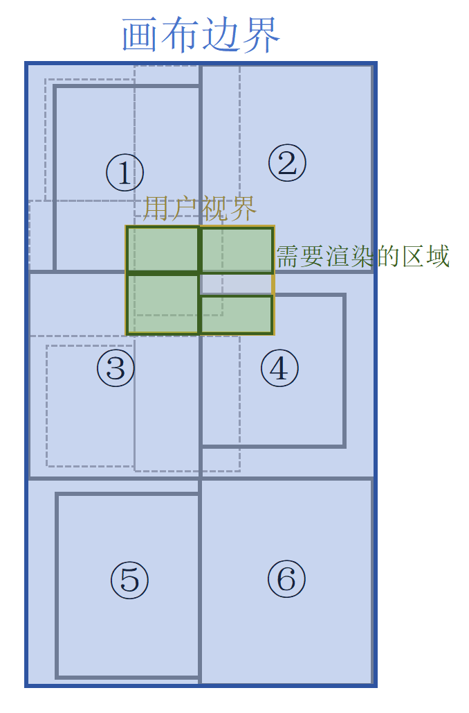

`ViewPlugin` 会动态重载 `Tab.visible_page_positions` 。这个属性会返回一个列表，列表的每个元素是一个三元组，即：

```python
List[Tuple[Page, Rect, Rect]]
List[(能见页面, 该页面上的能见区域, 该区域显示在整块 canvas 上的位置矩形)]
```

记其中一个元素为 `(page, rect1, rect2)` ， `Tab.render` 会渲染 `page` 的 `rect1` 区域，并将渲染得到的图像绘制在画布的 `rect2` 区域。

> [!CAUTION]
>
> 一般情况下，`rect2 = rect1 * zoom` 。除非，在“页面布局（视图）”部分选择了放缩页面，这种情况下计算 `rect1` 就麻烦喽。

#### 选择

`ViewPlugin` 会动态重载 `Tab.coord2real` 方法。该方法将鼠标点击事件在“用户视界”上的坐标转换为在画布上的坐标，即

```python
return (rect_view.x0 + event.x, rect_view.y0 + event.y)
```

`ViewPlugin` 会动态重载 `Tab.selectable_page_positions` 。这个属性会返回一个列表，列表的每个元素是一个二元组，即：

```python
List[Tuple[Page, Rect]]:
List[(可被选择的页面, 该页面的在整块 canvas 上的位置矩形)]
```

讨论：这里返回的 `Rect` 对象是哪个更好？

- [ ] 在未缩放的页面矩形平面上的矩形。
- [x] 在画布平面上的缩放后的矩形。

这两者仅仅差了一倍 `zoom` 而已，其他完全一样。

> [!CAUTION]
>
> 如果在“页面布局（视图）”部分选择了放缩页面，那么在计算鼠标落点在页面矩形框的哪个位置时，除了要除以 `zoom` ，还要除以放缩比例，再加上偏置项，偏置项要保证除好之后左上角坐标对应页面矩形的左上角坐标。
>
> - [ ] 将这部分计算量加入 `ViewPlugin` ？即，再提供一个接口函数，传入鼠标点击的坐标（画布坐标），输出点在哪个页面的某个位置；传入鼠标拖动的矩形（画布坐标），返回像 `Tab.visible_page_positions` 一样的输出矩形列表。

